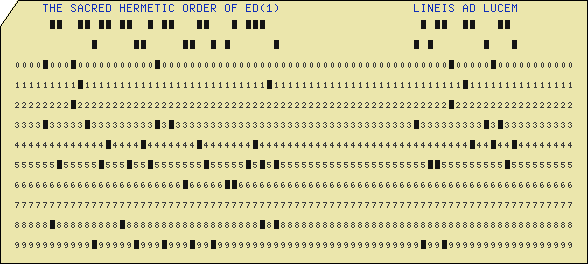

# Awesome Line Editors

**or, making teletype tech useful again**

(For some meaning of "awesome," anyway. "Interesting," might be more accurate.)

**THIS IS A WORK IN PROGRESS AND JUST STARTED. MORE TO COME. STAY TUNED.**

[Skip Intro](#various-line-editors)

# Table of Contents

- [Advertisement](#advertisement)
- [I can't be bothered to watch the videos, or I still don't get the point](#i-can't-be-bothered-to-watch-the-videos,-or-i-still-don't-get-the-point)
  - [First, distraction-free -- hey, a bird!](#first,-distraction-free----hey,-a-bird!)
  - [Thumb typing](#thumb-typing)
  - [And then the usual excuse](#and-then-the-usual-excuse)
  - [Finally, one crazy thing](#finally,-one-crazy-thing)
- [Some quick notes first](#some-quick-notes-first)
  - [Line editors vs. character editors](#line-editors-vs.-character-editors)
  - [How do I learn to use a line editor?](#how-do-i-learn-to-use-a-line-editor?)
- [On to the details, but first, some general external resources](#on-to-the-details,-but-first,-some-general-external-resources)
- [Disclaimer](#disclaimer)
- [Various Line Editors](#various-line-editors)
  - [ALE](#ale)
  - [ED.com (also led)](#ed.com-(also-led))
  - [EDLIN](#edlin)
  - [Teco](#teco)
  - [atto](#atto)
  - [buup](#buup)
  - [ed (aka., ed(1), and yes yes, aka., "The standard Unix editor"](#ed-(aka.,-ed(1),-and-yes-yes,-aka.,-"the-standard-unix-editor")
  - [em](#em)
  - [en](#en)
  - [ex](#ex)
  - [led (the one written in Lisp and compiled to Lua)](#led-(the-one-written-in-lisp-and-compiled-to-lua))
  - [qed](#qed)
  - [sam -d](#sam--d)

And also, "character editors," as well. And no, I'm not talking about 
the people who will fix your memoirs line-by-line for
a fee.  I am talking about text editors of yore, like the Unix ``ed(1)`` editor,
which operated in terms of lines, or like Teco, which theoretically operated in terms of
individual characters, and which were originally designed to work on a Teletext terminal
(or Teletype machine? What's the difference?) with a
printer printing one line at a time like God intended, instead of a video display, like 
these new-fangled modern computers for lazy people.

# Advertisement 

Before anything else, since a YouTube video is worth a thousand ill-chosen words, check out a 
couple of impressive demos. There are lots of other videos of people using line editors on YouTube (almost
all using the Unix ed(1) editor) but most were done by college students who just discovered ed
yesterday and don't know anything about it. They're mostly kind of embarrassing, frankly. But these
are the two cool ones I've found because they were done by legit wizards: 

 - [Ed text editor](https://www.youtube.com/watch?v=BNYpmLH6IjQ)
 - [Lambda Island 40. The Ultimate Dev Setup](https://www.youtube.com/watch?v=6oPRUzzP9DU)

# I can't be bothered to watch the videos, or I still don't get the point 

Yeah, OK, fair enough. For most people there is zero reason to be interested in line editors.
For what it's worth, here is how I came to appreciate them.

## First, distraction-free -- hey, a bird!

It all started as one of those "distraction-free writing environment" things. 
It may seem strange, but many writers find that one of the biggest enemies to productivity is the
tendency to stop when you're flowing and get distracted by editing what you've written.
The common wisdom is to separate writing (drafting) and editing. One solution is to write
long-hand. This works just until your hand gains strength and speed and you learn that
it's easy to quickly scratch something out and then re-write it. And re-write it,
over and over.

So the next step in the saga is to get a typewriter. You can waste a lot of time
tinkering with typewriters, and they do fit the bill. Editing while drafting with a
typewriter is indeed a big pain, which does encourage drafting without stopping, and editing later.
But it also keeps you rooted to one place. It's not
something you can take to the local coffee shop unless you want to annoy everyone around you
and generally look like a hipster jackass. (Of course, if you can stomach that, then more power to you,
and if you *are* a hipster jackass, then you just go on and be the best hipster jackass you can be!)

So, enter the humble line editor. You can learn to enter text into ed(1) in five minutes, but
the basic idea is that learning to do any real editing with a line (or character) editor is so
difficult, that you won't bother. You'll just type away, and then once you've finished drafting
something, you'll save it and open the file to edit in a proper text editor like THE, or Emacs, or vi,
or Microsoft Blub 3.0, right?

There's only one problem. It actually turns out that it only takes a little while before you'll learn
how to edit text in ed(1) quite quickly, and soon you will find yourself using ed voluntarily to make
little edits in config files, and then soon you'll realize that you like the minimal interface, the
no-bullshit feel of the line editor. You'll find yourself stopping what you're doing writing your
first draft, and getting sucked into endless editing, and completely lose your flow.

It turns out distraction-free writing is a state of mind, not a tool-set.

But then I continue to like line editors for another reason, which I can sum up in just two words:

## Thumb typing

Another part of the writing saga is trying to work out how to have the tools you need any time, anywhere
you are. For me, part of that is using Termux on my Android phone. I like Termux and have gotten good
at using it. I plug my phone into a port-replicator and get power to the phone and output to a proper monitor,
and decent keyboard input. But there are times when I'm waiting in line at the DMV and don't have a keyboard.
In short, I'm typing with my thumbs on a soft keyboard -- and more often than I'd like to admit. 
(What about this text itself? Am I writing it in a line editor? No, as it happens, I'm in vi in a Linux VM
on a Chromebook. So much for dog food.)

It seems slightly ironic to me, but the ultra-modern technology of the cell phone / pocket computer
has brought back a situation where the extremely terse command language of a line editor is a value
just as it was when the I/O model as a Teletype line printer without a CRT or the curses library, etc.
Thumb typing makes every extra character an annoyance, and even when ``Control`` and ``Alt`` and ``Escape`` are present
on the keyboard, key chording in general is an annoyance too. That leaves out Emacs for sure, and makes
vi barely tolerable. Ed and similar editors could have a renaissance, at least among hipster-nerd-writers,
I guess.

## And then the usual excuse

But in all seriousness, these days, line editors mostly have one purpose: to work when nothing else
will. For example, if your Linux machine is so hosed that it can't figure out
its terminal characteristics, and nothing works but command line programs that
don't try to do anything fancy with the screen, then a line editor is what you
will need for cleaning up that config file. (This can really happen; it's
happened to me.)

## Finally, one crazy thing

Line editors tend to be very terse, and to expose what amounts to a language for the manipulation of textual data.
Teco's command language is even Turing-complete. I don't know it
well enough to comment extensively, but if you appreciate the kind of thinking that went into Ken
Iverson's [Notation as a Tool of Thought](https://www.jsoftware.com/papers/tot.htm)
and think that APL is a great numerical language, and wouldn't
it be nice to have something with similar terseness specialized for text manipulation -- well then maybe
line editors are your thing. APL god [Aaron Hsu](https://www.sacrideo.us/)
seems to have thought so when he wrote his editor [ALE](https://github.com/arcfide/ALE)
(on which see below).

# Some quick notes first

## Line editors vs. character editors

Quick note, just like I said above: There is a distinction to be made between 
"line editors" and "character editors. The line may not be
very distinct. In the classic Unix ed(1) editor, the conceptual unit of structure is the line.
You navigate to and between and around lines. Once you've found a line you like, if you want to
change something, for example, you issue a (s)ubstitute command, and use a regular expression to
specify what you want to change, and then specify what you want to change it to as a string.
So that's nice. It takes a little getting used to. It's great, though, when you want to do a lot
of the same thing all at once, since you can use regular expressions to specify multiple lines at
the same time.

On the other hand, it's not great when you want to do complex changes within one line. For that, you
want an editor that has surgical commands for digging into lines at a character level. But then, it's
debatable whether that is really any faster than either using regexes -- or sometimes just retyping the line
entire.

In any case, some editors, like Teco (the Famed Father of Emacs) are called "character" or "character-level"
editors. For my purposes, they mostly all operate in such a way that they are like a little REPL for a text
editing programming language -- a DSL usually not Turing-complete, though famously, Teco's is.  

## How do I learn to use a line editor?

Well, first, pick one. I'll wait.

OK, now that you've picked ed(1), let me mention a couple of things.

1. It's not as hard to learn to use effectively as you think.
2. Google for ed tutorials. There are a number of them. Go through a couple to get a feel for things;
   then read the two PDFs I link to by Brian Kernighan under ed(1) below.
3. Just use the editor for daily stuff for a while and it will start to click.

# On to the details, but first, some general external resources

Well, mainly, there is the page on the Text Editor Wiki: [lineEditorsFamily](https://www.texteditors.org/cgi-bin/wiki.pl?LineEditorFamily)

Unfortunately much is out of date, and also most of the editors don't seem to have a realistic way to usefully
be run on modern systems (which I consider: Microsoft Windows, \*nix, MacOS, Android, IOS, and \*BSD).
But it's still a good place to start looking at things. Many could be run in a VM, but I don't consider that "usefully" unless
the VM is integrated into the host OS so tightly that it's a matter of just clicking on an icon or running a single
thing from the command line to get the editor (not the VM) to run. Termux counts as realistic, as does maybe WSL or the equivalent 
you can run on a Chromebook. But the Hercules mainframe emulator would be a case of not a "realistic way to usefully" run it.

This is the standard I am using in deciding what to include below, mostly. It is also where I would most appreciate PRs for this page
if you have anything can add to it.

# Disclaimer

The point and target of this page is to make line editors useful" so its purpose is practical. I have indulged in some extra
"honorable mentions" below for fun, and in some links to things of historical interest, but the main focus is on things that
can be actually compiled and run on "modern" systems and used daily.

Just to set the record straight, and all that.

# Various Line Editors
In strict ASCII sort order....

## ALE

*TBD*

## ED.com (also led)

*honorable mention*

ED.com is a line editor that was used on the CP/M operating system, a kind of
precursor to DOS. All I know about ED.com I learned from a pair of videos on YouTube
on a channel called "TechTinkering: [I Love ED on CP/M](https://www.youtube.com/watch?v=7pqaj050X7g) 
and the shorter, [A Very Quick Tour of ED on CP/M](https://www.youtube.com/watch?v=DY58jTcidxE)

ED (which I style ED.com in the CP/M style to differentiate it from the Unix ed(1))
appears to be something like a mix between a line-based editor and a character-
based editor, like Teco. This makes it appear complicated, byzantine -- and
interesting. I get the impression that it was written in assembly language and
that a port to modern systems would amount to a complete re-write. Et voila: Sage Hendricks
has a re-implementation for \*nix systems, called "led" (for "leaf context editor") on
[GitHub](https://github.com/sage-etcher/leaf-context-editor). I have been able to build it
on a couple of platforms, but either I don't know how to invoke it, or it doesn't work. 
If you're a c hacker, please make it work and let me know. 

There is also a [manual](http://cpmarchives.classiccmp.org/cpm/Library/Manuals/CPM_1.4_ED_Users_Manual_1978.pdf) available.

## EDLIN 

I'm really not sure about EDLIN. The original seems as if it may have been intended
to be a clone or simplified version of the ED.com editor from the old CP/M operating
system (about which more below). While the MS-DOS source has been released by Microsoft
on [GitHub](https://github.com/microsoft/MS-DOS/tree/main/v4.0/src/CMD/EDLIN) it is Assembly code
and could be challenging to re-implement.

The FreeDOS project has done an implementation in c which is on [GitHub](https://github.com/FDOS/edlin)
and I have been able to compile and run it on several POSIX or POSIX-adjacent systems, but my skimming 
some documentation suggests that the FreeDOS implementation is a simplified version
possibly lacking in character editing features of ED.com.

Here are a couple of videos about the FreeDOS version:

 - [Using FreeDOS - EDLIN](https://www.youtube.com/watch?v=CIlJeKuSl9w)
 - [Patreon bonus - Programming in EDLIN](https://www.youtube.com/watch?v=MUmiluneuoo)

There are native Windows binaries of FreeDOS EDLIN available [here](https://darrengoossens.wordpress.com/2019/05/25/native-edlin-on-windows-10/).

EDLIN came standard on MS-DOS machines and I believe up to about Windows 7,
in some versions, at any rate. It is a little more friendly 
than ed(1) and a good deal little less powerful, at least the FreeDOS version seems to me.
It is more than enough for
most use cases other, perhaps, than use in scripts. I intend to make sure this FDOS version
will compile on MacOS and \*BSD.

## Teco

*TBD*
## atto

*honorable mention* (Doesn't really seem to be usable.)

A very small line editor that really wants to use conio in the Microsoft environment, by Dieter Schoppitsch,
it is not to be confused with the Emacs-alike of the same name. See more information below under "buup." 

I've put a copy of the code on [GitHub](https://github.com/EvansWinner/atto_line_editor) with some small
changes to get it to compile under Linux. From there you can find Dieter's original page on the Wayback machine.

I also have started working a little on a slightly modified version for POSIX environments (see ``buup`` below).

## buup

*honorable mention* (Not quite usable uet.)

Basically my own attempt to modify ``atto`` for Linux use, on [GitHub](https://github.com/EvansWinner/buup) 
but not really ready to be used... kinda like this page itself.

## ed (aka., ed(1), and yes yes, aka., "The standard Unix editor"

'ed' is the "standard Unix text editor" as many have said and joked. It is also
probably the only line editor anyone reading this ought ever to bother with.
It comes standard or is easily gotten on any Linux, BSD, or on MacOS, and it 
has been ported to Microsoft Windows. It is mature, stable, and reliable.

Therefore it is uninteresting. Well, that's not entirely true, but the nerd
in me wants to find other options.

If ed(1) isn't on your Linux or BSD system, wipe your hard drive and install a better
distribution. Failing that, try something like ``sudo xbps-install ed`` or for you poor benighted souls, try
``sudo port install ed`` or ``sudo apt install ed`` -- you get the idea.

If you would like to know how it works, Google for a tutorial or two, and then when you've got a taste
of it, read Brian Kernighan's two classic tutorials, in order: 1) 
[A tutorial introduction to the UNIX text editor](https://www.nyx.net/~ewilli/edtut.pdf) and 2)
[Advanced Editing on UNIX](https://cscie26.dce.harvard.edu/~dce-lib113/reference/progtools/EdTut.pdf)

## em

*TBD*

## en

*TBD*

## ex

*TBD*

## led (the one written in Lisp and compiled to Lua)

*TBD*

## qed

QED was, it is said, written for an old 1960s machine using an old 1960s 
operating system. Various later versions appeared and eventually it was
re implemented in c, and there is a version on GitHub called [qed-new](https://github.com/phonologus/qed-new)
with Unicode support which will compile and run,
at least minimally, on POSIXy systems I've tried, with a little tinkering.
I do not know anything more about it and
haven't really played with it much, but it sports multiple buffers, which
is nice if you're into that kind of thing. It and "sam -d" might be the most
powerful line editors around.

Some links of general interest, of which the second is contained in the first:

- [Some QED / ex / vi historical documents](https://www.reddit.com/r/vim/comments/1o6s9m/some_qed_ex_vi_historical_documents/)
- [An incomplete history of the QED text editor](https://www.bell-labs.com/usr/dmr/www/qed.html)

## sam -d

*TBD*

---
Brought to you by --

