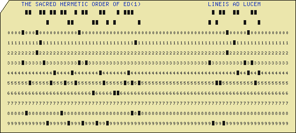

# Awesome Line Editors

**or, Making Teletype Tech Useful Again!**

(For some meaning of "awesome," anyway. "Interesting," might be more accurate.) 

## Praeliminaria

**THIS IS A WORK IN PROGRESS AND JUST STARTED. MORE TO COME. STAY TUNED.**

**→&nbsp;[Skip Intro](#the-editors)&nbsp;←**

### Table of Contents
- [Praeliminaria](#praeliminaria)
  - [Advertisement](#advertisement)
  - [I can't be bothered to watch the videos, or I still don't get the point](#i-cant-be-bothered-to-watch-the-videos-or-i-still-dont-get-the-point)
    - [First, distraction-free -- hey, a bird!](#first-distraction-free----hey-a-bird)
    - [Thumb typing](#thumb-typing)
    - [And then the usual excuse](#and-then-the-usual-excuse)
    - [Oh, and Suckless](#oh-and-suckless)
    - [Finally, one weird thing](#finally-one-weird-thing)
  - [Some quick notes first](#some-quick-notes-first)
    - [Line editors vs. character editors](#line-editors-vs-character-editors)
    - [How do I learn to use a line editor?](#how-do-i-learn-to-use-a-line-editor)
  - [Some general external resources](#some-general-external-resources)
  - [Disclaimers](#disclaimers)

- [The Editors](#the-editors)
  - [EDIT](#edit)
  - [EDLIN](#edlin)
  - [Teco](#teco)
  - [ed](#ed)
  - [em](#em)
  - [en](#en)
  - [ex](#ex)
  - [led 1](#led-1)
  - [led 2](#led-2)
  - [qed](#qed)
  - [sam -d](#sam--d)
- [Appendices](#appendices)
  - [Appendix A: Honorable Mentions](#appendix-a-honorable-mentions)
    - [ATTO](#atto)
    - [ALE](#ale)
    - [ED.COM](#edcom)
    - [buup](#buup)
  - [Appendix B: Mainly of Historical Interest](#appendix-b-mainly-of-historical-interest)
  - [Appendix C: Others](#appendix-c-others)
- [Colophon](#colophon)

And also, "character editors," as well. And no, I'm not talking about 
the people who will fix your memoirs line-by-line for
a fee.  I am talking about text editors of yore, like the Unix ``ed(1)`` editor,
which operated in terms of lines, or like Teco, which theoretically operated in terms of
individual characters, and which were originally designed to work on a Teletext terminal
(or Teletype machine? What's the difference?) with a
printer printing one line at a time like God intended, instead of a video display, like 
these new-fangled modern computers for lazy people.

### Advertisement 

Before anything else, since a YouTube video is worth a thousand ill-chosen words, check out a 
couple of impressive demos. There are lots of other videos of people using line editors on YouTube (almost
all using the Unix ``ed(1)`` editor) but most were done by college students who just discovered ``ed``
yesterday and don't know anything about it. They're mostly kind of embarrassing, frankly (the videos, I mean). But these below
are the two cool ones I've found because they were done by legit wizards: 

 - [Ed text editor](https://www.youtube.com/watch?v=BNYpmLH6IjQ)&nbsp; 
 - [Lambda Island 40. The Ultimate Dev Setup](https://www.youtube.com/watch?v=6oPRUzzP9DU)&nbsp; 

### I can't be bothered to watch the videos, or I still don't get the point 

Yeah, OK, fair enough. For most people, there is zero reason to be interested in line editors.
For what it's worth, here is how I came to appreciate them.

#### First, distraction-free -- hey, a bird!

It all started as one of those "distraction-free writing environment" things. 
It may seem strange, but many writers find that one of the biggest enemies to productivity is the
tendency to stop when you're flowing and get distracted by editing what you've written.
The common wisdom is to separate writing (drafting) and editing. One solution is to write
long-hand. This works just until your hand gains strength and speed and you learn that
it's easy to quickly scratch something out and re-write it. And re-write it,
over and over.

So the next step in the saga is to get a typewriter. You can waste a lot of time
tinkering with typewriters; they're fun and they do fit the bill. Editing while drafting with a
typewriter is indeed a big hassle, which encourages drafting without stopping, and editing later.

But it also keeps you rooted to one place. It's not
something you can take to the local coffee shop unless you want to annoy everyone around you
and generally look like a hipster jackass. (Of course, if you can stomach that, then more power to you;
and if you *are* a hipster jackass, then you just go on and be the best hipster jackass you can be, you!)

So, enter the humble line editor. You can learn to enter text into ``ed(1)`` in five minutes, but
the basic idea is that learning to do any real editing with a line (or character) editor is so
difficult, that you won't bother. You'll just type away, and then once you've finished drafting
something, you'll save it and open the file to edit in a proper text editor like THE, or Emacs, or vi,
or Microsoft Blub 3.0, right?

There's only one problem. It actually turns out that it only takes a little while before you'll learn
how to edit text in ``ed(1)`` quite quickly, and soon you will find yourself using ``ed`` voluntarily to make
little edits in config files, and then soon you'll realize that you like the minimal interface and the
no-bullshit feel of the line editor. You'll find yourself stopping what you're doing while writing your
first draft, and getting sucked into endless editing, and completely lose your flow.

It turns out distraction-free writing is a state of mind, not a tool-set.

But then I continue to like line editors for another reason, which I can sum up in just two words:

#### Thumb typing

Another part of the writing saga is trying to work out how to have the tools you need any time, anywhere
you are. For me, part of that is using
[Termux](https://termux.dev/en/)
on my Android phone. I like Termux and have gotten good
at using it. I plug my phone into a port-replicator with a real keyboard, get power to the phone,
and output to a proper monitor. But there are times when I'm waiting in line at the DMV and don't have a keyboard.
In short, I'm typing with my thumbs on a soft keyboard—and more often than I'd like to admit. 

It seems slightly ironic to me, but the ultra-modern technology of the cell phone / pocket computer
has brought back a situation in which the extremely terse command language of a line editor is a value
just as it was when the I/O model was a Teletype line printer sans CRT or curses library, &c.
Thumb typing makes every extra character an annoyance, and even when ``Control`` and ``Alt`` and ``Escape`` are present
on the keyboard, key chording in general is an annoyance too. That leaves out Emacs for certain and makes
``vi`` barely tolerable. ``ed`` and similar editors could have a renaissance, at least among hipster-nerd-writers,
I guess.

#### And then the usual excuse

But in all seriousness, these days, line editors mostly have one purpose: to work when nothing else
will. For example, if your Linux machine is so hosed that it can't figure out
its terminal characteristics, and nothing works but command line programs in ``/bin`` that
don't try to do anything fancy with the screen, then a line editor is what you
will need for cleaning up that config file. (This can really happen; it's
happened to me.)

#### Oh, and Suckless

Blah blah, small, blah, lightweight, blah blee bleh, [suckless](https://suckless.org/),
can be statically linked, blah blah, isn't a [systemd](https://ihatesystemd.com/why/) service or whatever,
Does One Thing and Does it Well[™](http://www.catb.org/esr/writings/taoup/html/ch01s06.html)—you
know, all that rap.

#### Finally, one weird thing

Line editors tend to be very terse, and to expose what amounts to a language for the manipulation of textual data.
Teco's command language is even Turing-complete. I don't know it
well enough to comment extensively, but if you appreciate the kind of thinking that went into Ken
Iverson's
[Notation as a Tool of Thought](https://www.jsoftware.com/papers/tot.htm)
and think that
[APL](https://en.m.wikipedia.org/wiki/APL_(programming_language))&nbsp;
is a great numerical language, and Wouldn't
it be nice to have something with similar terseness specialized for text manipulation?—well, then maybe
line editors are your thing. APL god
[Aaron Hsu](https://www.sacrideo.us/)
seems to have thought so when he wrote his editor
[ALE](https://github.com/arcfide/ALE) 
(on which see below, though in fact if you asked him what is a great language for text
processing with the terseness of APL, I bet he would answer: "APL!").

## Some quick notes first

### Line editors vs. character editors

Quick note, just like I said above: There is a distinction to be made between 
"line editors" and "character editors." The distinction may not actually be all that distinct.
In the classic Unix ``ed(1)'' editor, the conceptual unit of structure is the line.
You navigate to and between and around lines. Once you've found a line you like, if you want to
change something for example, you issue a (s)ubstitute command and use a regular expression to
specify what you want to change; then you specify what you want to change it to, as a string.
So that's nice. It takes a little getting used to. It's great, though, when you want to do a lot
of the same thing all at once, since you can use regular expressions to specify multiple lines at
the same time.

On the other hand, what if you want to do complex changes within one line? For that, you
want an editor that has surgical commands for digging into lines at a character level. But then, it's
debatable whether that is really any faster than either using regexes—or sometimes just retyping the line
entire.

In any case, some editors, like Teco (the Famed Father of Emacs) are called "character" or "character-level"
editors. For my purposes, they mostly all operate in such a way that they are like a little
[REPL](https://en.m.wikipedia.org/wiki/Read%E2%80%93eval%E2%80%93print_loop)&nbsp;
for a text
editing programming language—a DSL usually not Turing-complete, though famously, Teco's is;
and so I'm lumping them all together here.
Heck, maybe "REPL-based text editors" would be a better name for them.

### How do I learn to use a line editor?

Well, first, pick one. I'll wait.

OK, now that you've picked ``ed(1)``, let me mention a couple of things.

1. It's not as hard to learn to use effectively as you think.
2. Google for ``ed`` tutorials. There are a number of them. Go through a couple to get a feel for things;
then read the two PDFs I link to by Brian Kernighan under ``ed(1)`` below.
3. Just use the editor for daily stuff for a while and it will start to click.

## Some general external resources

- Obligatory Wikipedia page
  [Line editor](https://en.wikipedia.org/wiki/Line_editor)&nbsp;
- There is also a list on Wikipedia
  [here](https://en.wikipedia.org/wiki/List_of_text_editors#Line_editors)&nbsp;
- A YouTube playlist, of somewhat dubious quality... curated by myself:
  [Awesome Line Editors! \(And some not so awesome\)](https://www.youtube.com/watch?v=6ai0L__MROQ&list=PL-qKtep4qPg47t15pl4U4PE6NutDFn89F)&nbsp;
- Well, mainly, there is the page on the Text Editor Wiki:
  [lineEditorsFamily](https://www.texteditors.org/cgi-bin/wiki.pl?LineEditorFamily)

  Unfortunately much on that wiki is out of date, and also most of the editors don't seem to have a realistic way to usefully
  be run on modern systems.
  I conser those systems to be:
  - Unix and obviously Unix-like systems like Solaris, BSD, GNU/Linux, MacOS, Minix
  - Android, using something like Termux
  - IOS, using something like
    [iSH](https://ish.app/)
  - Microsoft Windows
  - FreeDOS and maybe even MS-DOS and similar
  - Even IBM mainframe and midrange systems like
    [z/OS](https://en.m.wikipedia.org/wiki/Z/OS)&nbsp;,
    [z/VM](https://en.m.wikipedia.org/wiki/Z/VM)&nbsp;,
    and whatever their marketing department calls
    [OS/400](https://www.ibm.com/products/ibm-i)
these days

  But it (the Text Editor Wiki) still seems a good place to start looking at things.

  Many could be run in a VM, but I don't consider that "usefully" unless
  the VM is integrated into the host OS so tightly that it's a matter of just clicking on an icon or running a single
  thing from the command line to get the editor (not the VM) to run.
  Termux counts as realistic, as does maybe
  [WSL](https://en.m.wikipedia.org/wiki/Windows_Subsystem_for_Linux)&nbsp; or the equivalent 
  you can run on a Chromebook. But, say, the
  [Hercules](https://sdl-hercules-390.github.io/html/)
  mainframe emulator
  ([fantastically](https://www.prince-webdesign.nl/tk5)
  cool as it may be) would be a case of not a "realistic way to usefully" run it. Same with 8 bit systems and emulators like
  [Commodore](https://en.m.wikipedia.org/wiki/Commodore_International)&nbsp;
  computers /
  [Vice](https://vice-emu.sourceforge.io/),
  &c., &c.

  This is the standard I am using in deciding what to include below, mostly.
  It is also where I would most appreciate PRs for this page if you have anything you can add to it.

## Disclaimers

Just to set the record straight.

### Focus on practically usable programs

The point and target of this page is to make line editors useful, so its purpose is practical. I have indulged in some extra
"honorable mentions" below for fun, and in some links to things of historical interest, but the main focus is on things that
can be actually compiled and run on "modern" systems and used daily. This excludes things that require elaborate emulators
to run, or editors embedded in single applications for use there only (like, in multi-user dungeon programs, or whatever you
call them.

Now, if you have interesting info about other line editors
(there must be a lot from the old 8-bit days I don't know about, among other things)
then please do send the information along and it can go in the appendices.

### Stuff could be wrong

Please send me a PR, or just a comment, with corrections or additions.
I'm just one person, with a real job, and you know, a family and a mortgage and all that.

# The Editors

In strict 
[ASCII sort order](https://www.cs.cmu.edu/~pattis/15-1XX/common/handouts/ascii.html)....

## EDIT

IBM's EDIT command from as far back as
[MVS](https://en.wikipedia.org/wiki/MVS)&nbsp;![img/wikipedia.png]
at least on
[TSO](https://en.wikipedia.org/wiki/Time_Sharing_Option)&nbsp;![img/wikipedia.png],
and still current in z/OS under
[TSO/E](https://www.ibm.com/docs/en/zos/2.4.0?topic=descriptions-tsoe).

[Jay Mosley](https://www.jaymoseley.com/)
has an extensive
[TSO Tutorial](https://www.jaymoseley.com/hercules/tso_tutor/tsotutor.htm)
including the use of EDIT, and there are about 100 pages of documentation on EDIT
in (among many other places) an old MVS
[TSO Command Language Reference](http://bitsavers.org/pdf/ibm/370/OS_VS2/Release_3.7_1976/GC28-0646-3_OS_VS2_TSO_Command_Language_Reference_Rel_3.7_Jan76.pdf)&nbsp;![img/pdf.png]
on
[Bitsavers](http://www.bitsavers.org/),
by IBM.

## EDLIN 

[Wikipedia Page](https://en.wikipedia.org/wiki/Edlin)&nbsp; | [Text Editor Wiki Page](https://texteditors.org/cgi-bin/wiki.pl?EDLIN)

### Commentary and one-liners

I'm really not sure about EDLIN (as it is sometimes written, or Edlin, as the FDOS project writes it).
[Tim Paterson's](https://en.wikipedia.org/wiki/Tim_Paterson)&nbsp;
original seems as if it may have been intended
to be a clone or simplified version of the ED.COM editor from the old CP/M operating
system (about which see the ED.COM entry).
While the MS-DOS
[source](https://github.com/microsoft/MS-DOS/tree/main/v4.0/src/CMD/EDLIN)&nbsp;
has been released by Microsoft,
it is Assembly code and could be challenging to assemble or re-implement.

The FreeDOS project has done an
[implementation](https://github.com/FDOS/edlin)&nbsp;
in c, and I have been able to compile and run it on several POSIX or POSIX-adjacent systems,
but my skimming some documentation suggests that
the FreeDOS implementation is a simplified version
possibly lacking in character editing features DOS EDLIN *may* have had.
\[Please correct me if I'm wrong.\]

EDLIN came standard on MS-DOS machines and I believe up to about Windows 7,
in some versions, at any rate. It is a little more friendly 
than ``ed(1)`` and a good deal little less powerful, at least the FreeDOS version seems so to me.
It is a functional text editor, though, for
most use cases other, perhaps, than use in scripts.

### Versions

#### xx-DOS version (MS-DOS, PC-DOS, whatever) versions

It may be possible to legitimately use one of the old versions for DOS if you have old hardware
but not so old you can't get data off of it. Otherwise, this is here mainly for historical interest.

#### Docs and Tutorials

*TBD*

#### Getting It

It is included with MS-DOS, so if you have that, you should have EDLIN.

#### Source

- Microsoft MS-DOS v.4 [source](https://github.com/microsoft/MS-DOS/tree/main/v4.0/src/CMD/EDLIN)&nbsp;. 

#### Binaries

*TBD*

### FreeDOS version

This is the one you will want to get and probably compile for modern systems.

#### Docs and Tutorials

Here are a couple of videos about Edlin from the FreeDOS project's YouTube
  [channel](https://www.youtube.com/@freedosproject)&nbsp;:

  - [Using FreeDOS - EDLIN](https://www.youtube.com/watch?v=CIlJeKuSl9w)&nbsp;   
  - [Patreon bonus - Programming in EDLIN](https://www.youtube.com/watch?v=MUmiluneuoo)&nbsp;

The FreeDOS tutorial page images don't seem to work, so here is a snapshot from the Wayback Machine:
[How to edit text with Edlin](https://web.archive.org/web/20231021151327/https://freedos.org/books/get-started/18-using-edlin/)&nbsp;

### Getting It

##### Source

- FreeDOS [source](https://github.com/FDOS/edlin)&nbsp;.

#### Binaries

 - Microsoft Windows 10: There are native Windows binaries of FreeDOS EDLIN available
   [here](https://darrengoossens.wordpress.com/2019/05/25/native-edlin-on-windows-10/).
 - Ubuntu Linux: There seems to be an apt package
   [available](https://launchpad.net/ubuntu/+source/edlin)

## Teco

*TBD*

## ed

(Aka. ``ed(1)``, and yes yes, also aka., "[The standard text editor](https://www.gnu.org/fun/jokes/ed-msg.html)."
(Obligatory link for everyone who hasn't already heard the joke—all both of you.))

``ed`` is, in addition to being the standard text editor as see above, also
probably the only line editor anyone reading this ought ever to bother with.
It comes standard or is easily gotten on any Linux, Unix, BSD, or on MacOS; and it 
has been ported to Microsoft Windows. It is mature, stable, and reliable.

Therefore it is uninteresting. Well, that's not entirely true, but the nerd
in me wants to find other options.

If ``ed(1)`` isn't on your Linux or BSD system, wipe your hard drive and install a better
distribution. Failing that, try something like ``sudo xbps-install ed`` or for you poor benighted souls, try
``sudo port install ed`` or ``sudo apt install ed``—you get the idea.

If you would like to know how it works, Google for a tutorial or two, and then when you've got a taste
of it, read Brian Kernighan's two classic tutorials, in order: 1) 
[A tutorial introduction to the UNIX text editor](https://www.nyx.net/~ewilli/edtut.pdf)&nbsp; and 2)
[Advanced Editing on UNIX](https://cscie26.dce.harvard.edu/~dce-lib113/reference/progtools/EdTut.pdf)&nbsp;

## em

*TBD*

## en

*TBD*

## ex

*TBD*

## led 1 

This is the "led" that is written in Lisp and compiled to Lua.

*TBD*

## led 2

This is the "led" that is a re-implementation of the CP/M ED.COM editor.

Sage Hendricks has a re-implementation if the CP/M ED.COM for \*nix systems called
[led](https://github.com/sage-etcher/leaf-context-editor)&nbsp;
(for "leaf context editor").
I have been able to build it on a couple of platforms,
but either I don't know how to invoke it, or it doesn't work. 
If you're a c hacker, please make it work and let me know. 

## qed

``qed`` (sometimes written QED)  was, it is said, written for an old 1960s machine using an old 1960s 
operating system. Various later versions appeared and eventually it was
re implemented in c, and there is a version available called
[qed-new](https://github.com/phonologus/qed-new)&nbsp;
with Unicode support which will compile and run,
at least minimally, on POSIXy systems I've tried, with a little tinkering.
I do not know anything more about it and
haven't really played with it much, but it sports multiple buffers, which
is nice if you're into that kind of thing. It and "sam -d" might be the most
powerful line editors around.

Some links of general interest, of which the second is contained in the first:

- [Some ``qed`` / ``ex`` / ``vi`` historical documents](https://www.reddit.com/r/vim/comments/1o6s9m/some_qed_ex_vi_historical_documents/)
- [An incomplete history of the QED text editor](https://www.bell-labs.com/usr/dmr/www/qed.html)

## sam -d

*TBD*

# Appendices

## Appendix A: Honorable Mentions

### ALE

*honorable mention* 

[Aaron Hsu's](https://www.sacrideo.us/)
editor
[ALE](https://github.com/arcfide/ALE)&nbsp;
is a line editor modeled on ``ed(1)`` in, apparently, something like 68 lines of characteristically inscrutable APL,
including blank lines for formatting.
I have not tested it in large part because it appears to be written for the
[Dyalog](https://www.dyalog.com/)
version of APL, for which you can get a
[free-for-noncommercial-use license](https://www.dyalog.com/download-zone.htm)
—which I have done in the past with great interest,
but at the moment I'm not set up for it and therefore have not been able to,
though I yet might—test it, that is.

I include it here, under "honorable mentions" only because its environment is so specialized
that it would not have much general use, and seems to be really a single-application editor.

### ATTO

*honorable mention* (Doesn't really seem to be usable.)

A very small line editor that really wants to use conio in the Microsoft environment, by Dieter Schoppitsch,
it is not to be confused with the Emacs-alike of the same name. See more information below under "buup." 

Dieter's original web page about ATTO archived from 2016 is
[here](https://web.archive.org/web/20160826220131/http://web.uta4you.at/shop/atto/index.htm)&nbsp;

I've posted a copy of the
[code](https://github.com/EvansWinner/atto_line_editor)&nbsp;
with some small changes to get it to compile under Linux.
From there you can find Dieter's original page on the Wayback machine.

I also have started working a little on a slightly modified version for POSIX environments (see ``buup`` below).

### ED.COM

*honorable mention*

Not really available on modern systems.

ED.COM is a line editor that was used on the
[CP/M](https://en.wikipedia.org/wiki/CP/M)&nbsp;
operating system, a kind of precursor to DOS.
All I know about ED.COM I learned from a pair of videos
done by someone whose name I haven't found, but whose channel on YouTube is called
[TechTinkering](https://www.youtube.com/@TechTinkering)&nbsp;:
 - [I Love ED on CP/M](https://www.youtube.com/watch?v=7pqaj050X7g)&nbsp;
   and the shorter,
 - [A Very Quick Tour of ED on CP/M](https://www.youtube.com/watch?v=DY58jTcidxE)&nbsp;

ED (which I style ED.COM in the CP/M style to differentiate it from the Unix ``ed(1)``)
appears to be something like a mix between a line-based editor and a character-
based editor, like Teco. This makes it appear complicated, byzantine—and
interesting. I get the impression that it was written in assembly language and
that a port to modern systems would amount to a complete re-write. See the entry for [led](#led-2] for an attempt at that.

There is also a
[manual](http://cpmarchives.classiccmp.org/cpm/Library/Manuals/CPM_1.4_ED_Users_Manual_1978.pdf)&nbsp;
available.

## Appendix B: Mainly of Historical Interest

The past is coming soon... or something.

## Appendix C: Others

This is mostly going to be school final projects on GitHub I think.
"Implement a line editor like ``ed``. Include commands to
open a file, write a file, print and replace lines."
I think there are a lot of them, but I'll probably only include them
if they at least compile and don't segfault when run.
Maybe there will be something valuable.

### buup

Not quite usable yet.

[buup](https://github.com/EvansWinner/buup)&nbsp;
is basically my own attempt to modify [ATTO](#atto) for Linux use,
but not really ready to be used... kinda like this page itself, really.

---

# Colophon

This was mostly written with [vim](https://www.vim.org/), frankly. Shoot me.
Some was in ``vi``, and yes, some in ``ed``. Right at this moment, I'm typing
in GitHub's web-based editor. So, I fear commitment
(though evidently not Git commitment).

Why this silly page about text editors? Because when you can't think of anything to make,
you end up spending all your time sharpening your tools.
I wanted a mission and despite my sins, nobody will give me one.

---

  Brought to you by— 
   

